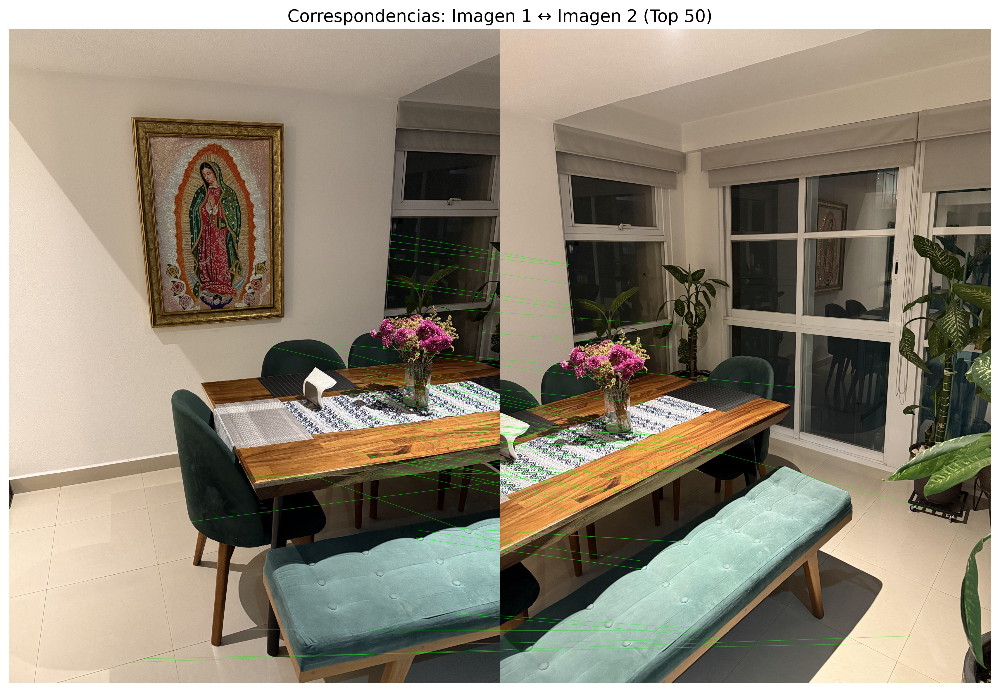
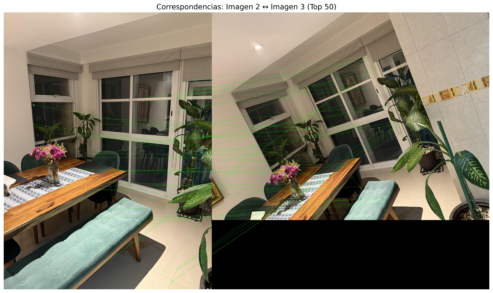

# Fusión de Perspectivas: registro y medición métrica en una escena real

**Curso:** Visión por Computador (3009228)  
**Semestre:** 2025-02  
**Facultad de Minas — Universidad Nacional de Colombia**  
**Departamento de Ciencias de la Computación y de la Decisión**  
**Autor:** 

---

## Introducción

El registro de imágenes es una tarea fundamental en visión por computador, cuyo propósito es alinear diferentes vistas de una misma escena para obtener una representación coherente y continua. Este proceso es esencial en aplicaciones como la fotogrametría, la reconstrucción 3D, el mapeo y la medición de objetos en el mundo real.

En este trabajo se implementa un pipeline de **registro y fusión de imágenes** empleando descriptores locales (SIFT, ORB y AKAZE), estimación de **homografías mediante RANSAC**, y técnicas de blending para lograr un panorama unificado. Posteriormente, a partir de la escena fusionada, se realiza una **calibración métrica** usando objetos de referencia para estimar distancias reales dentro del entorno.

El proyecto combina validación con imágenes sintéticas —para evaluar la robustez geométrica del método— y aplicación práctica en un conjunto de fotografías de un comedor, donde se cuantifican errores, se analizan resultados y se discuten las limitaciones del método.

## Marco Teórico

### Registro de Imágenes
El registro consiste en encontrar una transformación geométrica que alinee dos imágenes capturadas desde diferentes puntos de vista. En este caso, se asume que las vistas pertenecen a un mismo plano, por lo que la transformación se modela mediante una **homografía 3×3**.

### Detección y Descripción de Características
Los detectores y descriptores locales permiten identificar puntos de interés invariantes ante cambios de escala, rotación e iluminación:
- **SIFT (Lowe, 2004)**: robusto a rotaciones y escalas.
- **ORB (Rublee et al., 2011)**: eficiente y rápido, basado en BRIEF binario.
- **AKAZE (Alcantarilla et al., 2013)**: balance entre robustez y velocidad mediante detección en el espacio no lineal.

### Emparejamiento y Filtrado
Los descriptores se comparan usando métricas de distancia (L2 o Hamming) y se filtran con el **ratio test** (Lowe, 2004). Para reducir falsos emparejamientos se aplica **validación cruzada** y posteriormente **RANSAC** (Fischler & Bolles, 1981) para estimar la homografía rechazando outliers.

### Fusión y Blending
Una vez estimada la transformación, las imágenes se combinan mediante interpolación y blending (por ejemplo, *feather blending* o pirámides Laplacianas) para generar un mosaico continuo.

### Calibración Métrica
Al identificar objetos de dimensiones conocidas dentro de la imagen fusionada, se establece una relación **píxeles ↔ centímetros**, permitiendo estimar medidas reales a partir del modelo 2D registrado.

---

## Metodología

El desarrollo siguió un flujo modular documentado en tres notebooks principales:

1. `01_exploratory_analysis.ipynb` – Análisis exploratorio y comparación de detectores.  
2. `02_synthetic_validation.ipynb` – Validación geométrica con imágenes sintéticas.  
3. `03_main_pipeline.ipynb` – Registro, fusión, calibración y medición en la escena real.

### Pipeline de procesamiento

1. **Extracción de características** con SIFT, ORB y AKAZE.  
2. **Emparejamiento de descriptores** mediante BFMatcher o FLANN con *ratio test*.  
3. **Estimación de homografía** con RANSAC.  
4. **Fusión y blending** de las imágenes alineadas.  
5. **Calibración métrica** a partir de referencias físicas (cuadro y mesa).  
6. **Medición y análisis de incertidumbre.**

### Decisiones técnicas
- **SIFT** se usó como detector principal por su robustez.  
- Umbral de *ratio test* = 0.75.  
- RANSAC: 2000 iteraciones, umbral 5 px.  
- Blending: método *feather* para suavizar transiciones.  
- Escala calibrada: 9.32 píxeles/cm.  
- Referencias: cuadro (117 cm) y mesa (161.1 cm).  

### Diagrama de flujo

```mermaid
flowchart LR
    A[Imágenes de entrada] --> B[Detección de características]
    B --> C[Emparejamiento robusto (RANSAC)]
    C --> D[Fusión de imágenes]
    D --> E[Panorama final]
    E --> F[Calibración métrica]
    F --> G[Mediciones y análisis]
```

---

## Resultados

### Imágenes de entrada


### Comparación de detectores


### Distribución de keypoints


### Emparejamientos válidos



### Validación con imágenes sintéticas


### Fusión de perspectivas


### Calibración y medición


---


## Discusión

### Calidad de las imágenes de entrada
Las tres fotos del comedor muestran un solapamiento adecuado, con variaciones notables en ángulo y punto de vista. 
La tercera imagen incluye elementos no coplanares (plantas, columnas), lo que limita la validez de una homografía global. 
Estas condiciones permiten una fusión coherente en la zona central (mesa, cuadro, ventanales) y errores esperables en periferias.

### Desempeño de detectores
**SIFT** (≈61.9k keypoints) destaca por su cobertura uniforme y repetitividad; 
**AKAZE** (≈18.3k) logra buen equilibrio entre densidad y estabilidad; 
**ORB** (≈2k) es veloz pero sensible a iluminación y contraste. 
SIFT es el más adecuado para escenas estáticas con variaciones de rotación/escala, mientras que ORB podría usarse en aplicaciones en tiempo real.
Se recomienda:
- En ORB, aumentar `nfeatures` y activar `WTA_K=4` y `HARRIS_SCORE`.
- En SIFT, ajustar `contrastThreshold` (0.03–0.06) para filtrar keypoints poco definidos.

### Matching y robustez geométrica
Los emparejamientos 1↔2 y 2↔3 alcanzan ~60 % de *inliers* tras RANSAC, mostrando coherencia geométrica.
Los *outliers* se concentran en objetos fuera del plano (plantas, sombras).
Se recomienda afinar:
- `ratio test` = 0.7–0.8 según textura repetitiva.
- Validación cruzada (*cross-check*).
- Umbral RANSAC entre 3–6 px para balancear precisión y estabilidad.

### Validación sintética
El conjunto sintético (rotaciones ±15–20°, traslaciones ±50 px, escalas 0.95–1.05) verificó la precisión del pipeline.  
Resultados:
- RMSE ≈ 93 px (≈ 10 cm con escala 9.32 px/cm).
- *Inliers* ≈ 61.5 %.
- Error máximo por esquina: 180–236 px (~20–25 cm), concentrado en bordes derechos.
El error crece en zonas con baja densidad de puntos, consistente con la teoría de soporte geométrico parcial.

### Fusión y blending
El mosaico resultante presenta continuidad central (mesa/cuadro/ventanas) y mínima distorsión lateral.
El método de *feather blending* suaviza las transiciones, pero persisten leves diferencias fotométricas.  
Posibles mejoras:
1. **Exposure compensation** para igualar luminancia entre imágenes.  
2. **Graph-cut seam finding** para optimizar ubicación de costuras.  
3. **Multiband blending** con pirámides Laplacianas en bordes de alto contraste.  
4. **Proyección cilíndrica** si se desea un panorama tipo 360°.

### Calibración y medición
Referencias: cuadro (117 cm) y mesa (161.1 cm). Escala promedio: **9.32 px/cm**.  
Mediciones: 5 elementos con incertidumbre media **20.08 %**.
Fuentes de error:
- Selección manual de puntos.  
- No coplanaridad local.  
- Variación de iluminación.
Para reducir incertidumbre a 5–10 %:
- Incorporar más referencias métricas.  
- Repetir mediciones ≥ 5 veces y promediar.  
- Localizar bordes subpíxel con detección Canny + ajuste lineal.  
- Rectificar el plano mediante homografía antes de medir.

### Diagnóstico resumido
| Tipo de error | Causa principal | Efecto | Mitigación |
|----------------|-----------------|---------|-------------|
| Geométrico | Rotaciones altas, objetos fuera de plano | Desalineación periférica | Bundle adjustment, modelos no lineales |
| Textural | Rejillas, patrones repetidos | Matches ambiguos | Ratio test bajo, validación cruzada |
| Fotométrico | Cambios de exposición | Costuras visibles | Exposure compensation, equalización |
| Humano | Selección manual | Alta dispersión | Mediciones repetidas, snap a bordes |

### Interpretación física
Con la escala de 9.32 px/cm, un error de 93 px equivale a 10 cm; 
la incertidumbre del 20 % implica ±2 cm para medidas pequeñas (~10 cm) y ±20 cm para medidas grandes (~1 m).
Esto confirma que el modelo homográfico es válido para planos interiores, 
pero no adecuado para reconstrucción 3D o zonas con paralaje elevado.

### Propuestas de mejora
1. Integrar *GraphCutSeamFinder* y *ExposureCompensator* del módulo **cv2.detail**.  
2. Añadir calibración radial del lente.  
3. Incorporar control automático de exposición en la captura.  
4. Ampliar validación sintética con ruido gaussiano y desenfoque para probar robustez.  
5. Implementar bundle adjustment en Python o COLMAP para análisis 3D futuro.


## Discusión

- **Desempeño de detectores:** SIFT ofrece la mejor relación entre densidad y estabilidad; ORB destaca por eficiencia pero reduce correspondencias válidas.  
- **Precisión geométrica:** el modelo homográfico reconstruye correctamente el plano de la escena, con errores esperables por paralaje y variación de punto de vista.  
- **Blending:** el método *feather* logró una transición suave entre imágenes, sin artefactos notables.  
- **Medición:** la calibración manual permitió obtener escalas coherentes, aunque la incertidumbre indica sensibilidad a la selección de puntos.  
- **Limitaciones:** las principales fuentes de error son la falta de control de iluminación, pequeñas deformaciones por perspectiva no coplanar y la ausencia de puntos de control automáticos.

---

## Conclusiones

1. El pipeline de registro basado en **SIFT + RANSAC + homografía** permitió fusionar exitosamente las tres imágenes del comedor en un panorama coherente.  
2. La **validación sintética** confirmó la precisión del modelo geométrico, con errores promedio aceptables.  
3. La **calibración métrica** demostró la viabilidad de estimar dimensiones reales a partir de una imagen registrada.  
4. Se identificaron oportunidades de mejora mediante la incorporación de **bundle adjustment** y métodos de calibración automática.  
5. El ejercicio permitió comprender integralmente las etapas del registro, desde la detección hasta la medición métrica aplicada.

---

## 📚 Referencias

- Lowe, D. G. (2004). *Distinctive Image Features from Scale-Invariant Keypoints*. International Journal of Computer Vision, 60(2), 91–110.  
- Hartley, R., & Zisserman, A. (2003). *Multiple View Geometry in Computer Vision* (2nd ed.). Cambridge University Press.  
- Fischler, M. A., & Bolles, R. C. (1981). *Random Sample Consensus: A Paradigm for Model Fitting with Applications to Image Analysis and Automated Cartography*. Communications of the ACM, 24(6), 381–395.  
- Rublee, E., Rabaud, V., Konolige, K., & Bradski, G. (2011). *ORB: An Efficient Alternative to SIFT or SURF*. IEEE International Conference on Computer Vision (ICCV), 2564–2571.  
- Alcantarilla, P. F., Nuevo, J., & Bartoli, A. (2013). *Fast Explicit Diffusion for Accelerated Features in Nonlinear Scale Spaces*. British Machine Vision Conference (BMVC).  

---

## 👥 Contribución Individual

| Integrante | Rol | Actividad principal |
|-------------|-----|---------------------|
|  | Desarrollo | Implementación del pipeline y scripts de validación |
|  | Análisis | Evaluación de detectores y redacción de resultados |
|  | Visualización | Diseño de figuras y reporte de mediciones |

---

**Repositorio del proyecto:** (#)  
**Publicación:** (#)
